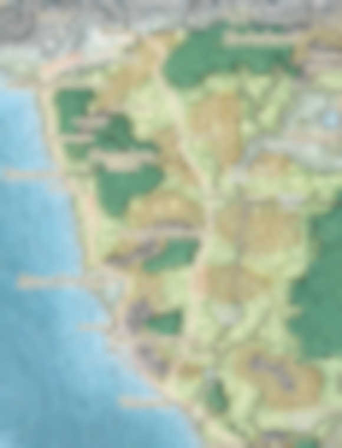
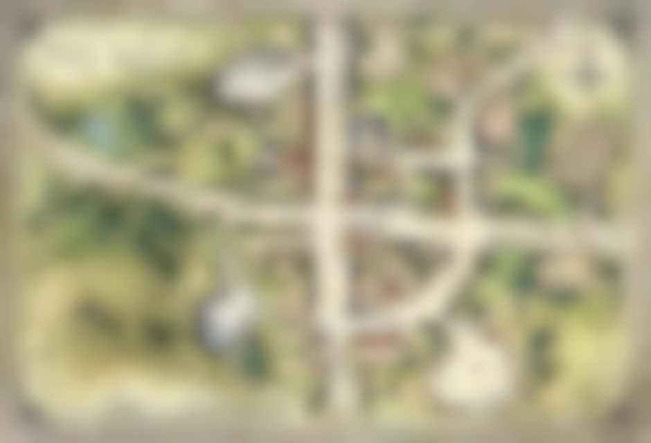
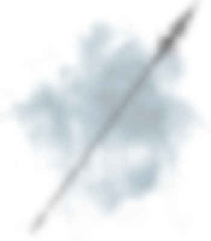
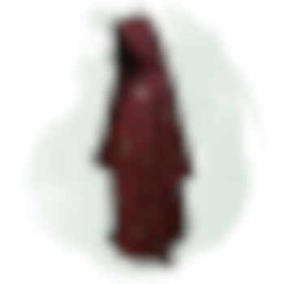
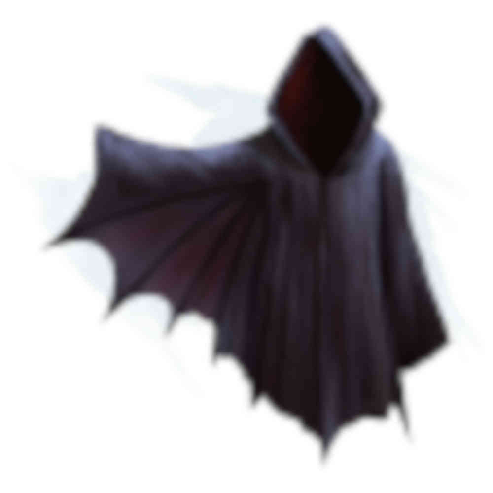
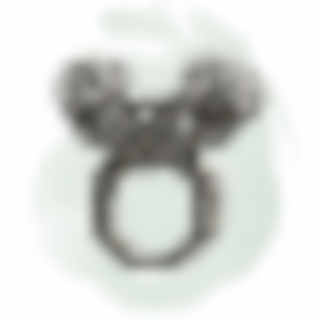
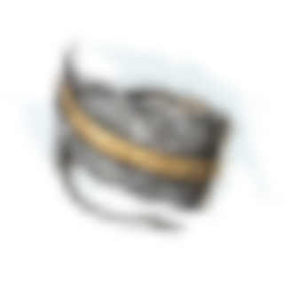

# Campaign

Modified Princes of the Apocalypse starting at level 8.

## Resources

### Docs

-   [Elemental Evil Players Companion PDF (23 MB)](https://media.wizards.com/2015/downloads/dnd/EE_PlayersCompanion.pdf)
-   [Elf Lore from Mordenkainen's Tomb Of Foes (12 MB)](https://s3-eu-west-1.amazonaws.com/dnd.bfjnaude.com/files/Elves.pdf)

### Maps

<a href="./screen.html">Goto live screen<a>

    
Sword Coast

    

 

    
Dessarin Valley

    

 

    
Scarlet Moon Hall

    

    
Red Larch

    

## Characters

### PCs

-   Cranorin, the wood elf druid, but you can call him Crain (presumed dead)
-   Shava, the rogue ranger, quite fond of my coin, alchemy & apothecary (presumed dead)
-   Coldor, the high elf necromancer, with a flair for the dramatic (presumed dead)
-   Elliania, the half elf druid, quiet with an affinity for wolves (presumed dead)

-   Thorin Graniteskull, dwarven fighter and keeper of grudges
-   Peren Calabra, human bard & charismatic performer
-   Moonpie Shadow, felis on a quest to undo a curse on her people
-   Yasheira Khalid, monk & explorer

### NPCs

Darius

Inkeeper of the Snoring Giant Inn. Stout dark haired human man, tanned skin, hairy chest & forearms, mutton chops. Tells
the party about strange happenings in the valley.

Darreth

Commoner from Womford. Captured by the elemental cults for one of their sacrificial rituals. Has met many of the elemental
priest.

Bastion

Fire genasi in the Fire Cult's dungeon. Has some ambition to depose Vanifer. Asked the party to kill Vanifer and bring
him their dagger for a hefty sum. After Vanifer's death, he finds himself in a awkward position where he is fighting an
Efreeti for control of the fire cult. He enlists the help of a Fire Giant by promising him Tinderstrike as reward for
helping to dispose of the Efreeti.

His plans are cut short when he crosses paths with a group of adventurers who kidnap and kill him. After dying he comes
back as a wraith, out for vengeance, but ultimately fails in this quest.

Amon the Mighty

(Amon the Mighty, Enslaver of the lesser races, Master Trader, Magic Smith, Blessed of Imix)

An Efreeti with a sadistic streak. A slaver of Azers and Salamanders who uses his slaves to manufacture rare items. Amon
establishes himself in a forge on the material plane, in the ruins of Tyar-Basil. This place has a strong connection to
the elemental plane of fire. He encounters a cult of fire worshippers and sees an opportunity to attain more power.

The cult has an artifact of Imix. Amon must have it.

## Items

Windvane

Weapon (spear), legendary (requires attunement)

A silver spear, Windvane has dark sapphires on the filigreed surface of its polished head. Held by its shining haft, the
weapon feels insubstantial, as if clutching a cool, gently blowing breeze. The spear contains a spark of Yan-C-Bin, the
Prince of Evil Air.

You have a +2 bonus to attack and damage you make with this magic weapon, which has the finesse weapon property. When
you hit with it, the target takes an extra 1d6 lightning damage.

Air Mastery. You gain the following benefit while you hold Windvane:

-   You can speak Auran fluently.
-   You have resistance to lightning damage.
-   You can cast dominate monster (save DC 17) on an air elemental. Once you have done so, Windvane can’t be used in
    this way agin until the next dawn.

Tinderstrike

Weapon (dagger) legendary (requires attunement)

A flint dagger, Tinderstrike is uncommonly sharp, and sparks cascade off its edge whenever it strikes something solid.
Its handle is always warm to the touch, and the blade smolders for 1d4 minutes after it is used to deal damage. It
contains a spark of Imix, Prince of Evil Fire.

You gain a +2 bonus to attack and damage rolls you make with this magic weapon. When you hit with it, the targets takes
an extra 2d6 fire damage.

_Fire Mastery._ You gain the following benefits while you hold Tinderstrike:

-   You can speak Ignan fluently.
-   You have resistance to Fire damage.
-   You can cast Dominate Monster (Save DC 17) on a Fire Elemental. Once you have done so, Tinderstrike can’t be used
    this way again until the next dawn.

_Dance of the All-consuming Fire._ While inside a fire node, you can perform a ritual called the Dance of the
All-Consuming Fire, using Tinderstrike to create a devastation orb of fire (see the devastation orbe description for the
time and cost of the ritual). Once you prefrom the ritual, Tinderstrike can't be used to perform the ritual again until
the new dawn. _Flaw_. Tinderstrike makes its wielder impatient and rash. While attuned to the weapon, you gain the
following flaw: "I act without thinking and take risks without weighing the consequences."

If you help slay a fire elemental while attuned to the weapon, you gain access to the following additional properties:

-   You can cast the following spells from the dagger, expending the necessary number of charges: burning hands (1
    charge), fireball (2 charges), or wall of fire (3 charges).

After helping to slay a fire elemental, the Weapon has 5 charges. It regains 1d4 = 1 expended charges daily at dawn.
Spells cast from the weapon have a save DC of 17.

Robe of Eyes

Adventuring Gear (Wondrous Item, Robe) rare (requires attunement)

This robe is adorned with eyelike patterns. While you wear the robe, you gain the following benefits:

-   The robe lets you see in all directions, and you have advantage on Wisdom (Perception) checks that rely on sight.
-   You have Darkvision out to a range of 120 feet.
-   You can see Invisible creatures and Objects, as well as see into the Ethereal Plane, out to a range of 120 feet.

The eyes on the robe can't be closed or averted. Although you can close or avert your own eyes, you are never considered
to be doing so while wearing this robe.

A light spell cast on the robe or a Daylight spell cast within 5 feet of the robe causes you to be Blinded for 1 minute.
At the end of each of your turns, you can make a Constitution saving throw (DC 11 for light or DC 15 for daylight),
ending the blindness on a success.

Cloak of the Bat

Adventuring Gear (Wondrous Item, Shoulders) rare (requires attunement)

While wearing this cloak, you have advantage on Dexterity (Stealth) checks. In an area of dim light or Darkness, you can
grip the edges of the cloak with both hands and use it to fly at a speed of 40 feet. If you ever fail to grip the
cloak's edges while flying in this way, or if you are no longer in dim light or Darkness, you lose this flying speed.

While wearing the cloak in an area of dim light or Darkness, you can use your action to cast Polymorph on yourself,
transforming into a bat. While you are in the form of the bat, you retain your Intelligence, Wisdom, and Charisma
scores. The cloak can't be used this way again until the next dawn.

Ring of the Ram

Ring (Ring) rare (requires attunement)

This ring has 3 Charges, and it regains 1d3 expended Charges daily at dawn. While wearing the ring, you can use an
action to expend 1 to 3 of its Charges to Attack one creature you can see within 60 feet of you. The ring produces a
spectral ram's head and makes its Attack roll with a +7 bonus. On a hit, for each charge you spend, the target takes
2d10 force damage and is pushed 5 feet away from you.

Alternatively, you can expend 1 to 3 of the ring's Charges as an action to try to break an object you can see within 60
feet of you that isn't being worn or carried. The ring makes a Strength check with a +5 bonus for each charge you spend.

Ring of Feather Falling

Ring (Ring) rare (requires attunement)

When you fall while wearing this ring, you descend 60 feet per round and take no damage from Falling.

## Campaign Logs

### Wed 17 Apr 2019

Character creation and campaign rules discussion.

#### Character creation

4 Characters at 8th level. Two druids, a wizard and a mutliclass rogue/ranger

#### Rules discussion

-   Base game rules
-   All spells and abilities from official 5e books are available
-   Critical failures might have dire consequences
    

### Wed 24 Apr 2019

 First session: Attack from the air

#### 1st of Kythorn 1453

The characters seek shelter at a local in Westbridge, The Sleeping Giant, after a storm starts to kick up...

During the storm Aerisi is flying around in the clouds summoning lightning and air elementals to terrorize the town.

The party takes down Aerisi and the elemental. Shava claims Windvane. (4800 XP)

Shava goes on an expidition to try and obtain some arrows while the rest of the party sleeps. She finds the local
workshop, but is not able to obtain any completed arrows.

### Wed 1 May 2019

 Second session: Bonfire in the valley

#### 2nd of Kythorn 1453

The party makes their way down The Stone Trail. After a day of travelling they decide to set up camp at the foot of the
Sumber Hills near River Dessarin. They spot fire raining down from the sky deeper into the Sumber Hills and want to
investigate.

Elliania uses divination to surmise the nature of the fire that rained from the sky and receives the answer "Unnatural.
Do not trust them"

The party sees smoke further into the Sumber hills as the sun sets. They decide they need to investigate in the morning.

#### 3rd of Kythorn 1453

The party breaks camp and decides to head in the direction of the smoke they saw on the previous day.

On their approach they spot a tower on a hill, in the area where the smoke originated. Two party members decide to sneak
closer to investigate. When they spot a burned out camp and two fire elementals patrolling the area.

The party attacks the Fire Elemental Myrmidons patrolling at the foot of the Scarlet Moon Hall. After defeating the
elementals, the party starts to raid the camp as they explore. They find many burnt corpses, some scrolls and a few gold
coins.

While exploring the summit of the hill the party encounters a Flame Guardian and two Hell Hounds.

During the fighting the Flame Guardian submits.

### Wed 9 May 2019

 Third session: Scalet Moon Hall Tower

#### 3rd of Kythorn 1453

During the fighting the Flame Guardian submits... and promptly gets skewered by two crossbow bolts. The party takes
cover next to the Scarlet Moon Hall tower. The scaffolding is set alight by a dropped oil lamp. Coldor summons Ice
Mephits to douse the flames and a battle ensues with the flame cultists residing in the tower.

During the battle an unknown druid escapes at the base of the tower...

The party loots the druids living quarters for some gold, gems and a scroll, before fighting some giant bats in the
attic, after a failed attempt at animal diplomacy.

The party opts to take a short rest in the top of the tower.

### Wed 15 May 2019

 Fourth session: Scalet Moon Hall Tower Pt.2, into the fire temple

#### 3rd of Kythorn 1453

The party opts to take a short rest in the top of the tower...

The party descends the tower and has an encounter with some magmins and proceed down a hidden tunnel.

Following the tunnel leads the party to a chamber underground. Elliania finds a secret door in one of the tunnels. On
the other side of the secret door the party finds a Fire Genasi named Bastion, who convinces them to go find and kill
Vanifer to bring him her dagger...

The party agrees to go and find Vanifer.

After following Bastion's instructions the party finds Vanifer praying at an altar, with a corpse atop it.

A failed stealth attempt leads to a large battle with Vanifer and her fire Elementals. Vanifer escapes...

### Wed 22 May 2019

 Fifth session: Inside Vanifer's chamber

#### 3rd of Kythorn 1453

The party hunts for Vanifer and after searching the altar chamber find the secret door down to Vanifer's chambers.

Vanifer makes her last stand. The party seizes Tinderstrike after Vanifer's body goes up in smoke.

Vanifer's chamber is barricaded as the group tries to take a long rest.

#### 4th of Kythorn 1453

After their long rest a fight breaks out when the party tries to sneak past a group of sleeping cultist. A fight breaks
out, many people die... also hobgoblins. A mage, named Lizzy manages to escape.

### Wed 5 June 2019

 Sixth session: Murderings things 

#### 4th of Kythorn 1453

The party goes on a murdering spree, killing all they found in the Fire Temple

### Wed 12 June 2019

 Seventh session: Murdering things part II, electric boogaloo  

#### 4th of Kythorn 1453

The gang goes exploring in the fire dungeon. They smooze their way pasts some razerblasts and avoid a tripwire trap
attached to a dwarven statue.

After furhter exploration they find some fire cultists bunking next to a small underground prison. The group
methodically clears the fire cultists from the area, after which they start freeing a group of salamanders and a group
of azers. There is clear conflict between the two groups, but the party convinces them to band together to overthrow the
local Efreeti slavedriver who was holding them captive.

In their attempt to take down the Efreeti and his minions the salamanders and azers start attacking each other... With
their allies fighting each other, the Efreeti makes short work of the party. They are slain in the fire dungeon.

### Wed 19 June 2019

 Eighth session: Restart  

#### 30th of Kythorn 1453

Thorin and Peren find themselves in a cell, inside a stiflingly hot cave, after an unfavorable encounter involving some
cultist, and a stray fireball bead from a certain gnome warlock.

A newcomer, Yasheira, is dragged into their cell by some flame cultist henchmen. After acquaintances are made, it
becomes clear that an escape has to be made if they plan to survive.

Meanwhile, Moonpie Shadow, a felis druid, wanders through the cave system of her captors. She has curried enough favor
with the person in charge to have gained some basic freedoms. She happens upon the newcomers in their cells and decides
to investigate.

After introductions, Peren convinces Moonpie to aid them in their escape. They manage to trick the cultists guardian
their cells to enter the cell, in search of an illusory gold disc. Striking at the opportune moment, the prisoners
manage to overpower the guards and make their escape into the cave system. Moonpie leads the party to a section of the
cave where she has found refuge. The party tries to sneak their way there an run into a pack of hell hounds. An intense
battle ensues. The hell hounds are defeated.

### Wed 26 June 2019

 Ninth session: Restart pt. II, portal run 

#### 30th of Kythorn 1453

The gang made their way to Moonpies cool hideout to rest. After their rest the party is attacked by a wandering group of
Fire Snakes, who are out hunting for food.

After crushing the fire snakes, the party tries to make their escape. Moonpie convinces the others to follow her to a
part of the cave system where she saw Bastion enter a portal. The group stealthily made their way to portal, where they
encounter Bastion. Bastion tries to make an escape, but the party overpowers him as he opens the portal. They make their
way through the portal...

### Wed 17 July 2019

 Tenth session: Through the wormhole 

#### 30th of Kythorn 1453

The party runs away from many big monsters. A giant, a cult mob and a chimeara... Bastion is left as bait to distract
chimeara. The group makes their way out of the fire dungeon and tackles a group of Ogres in the Earth Cult's quarter.
The dwarf, staying true to form was the instigator of said encounter.

They decide to barricade themselves in and rest for the night.

### Wed 24 July 2019

 Eleventh session: It's not ogre yet 

#### 1st of Flamerule 1453

After hearing spooky noises the party decides to leave the ogre den to explore the stone dungeon...

As soon as they exit the ogre den, the group encounters two bullettes fighting in the adjacent chamber. The bullettes
cause the chamber to start collapsing, so the party decides to make a run for it.

Peren starts to recall the area and leads the group to an exit. Before they reach the exit, the party encounters an
earth elemental and it's friends. Combat ensues. After dealing with the elementals Peren leads the way to the Stone
Monastery via a tunnel network and a very tall staircase.

Our adventurers find themselves in the basement dungeon under the monastery, which is infested by shambling troops of
zombies. They make use of the maze like nature of the dungeon to avoid the zombies and find their way to the monastery
proper.

Exiting the monastery the party sees daylight for the first time in a long while. They decide to leave and go looking
for the nearest town.

### Wed 31 July 2019

 Twelfth session: Giants & revelations 

#### 1st of Flamerule 1453

After a bit of a detour the adventuring band find a trail heading NW to SE. They decide to set up camp a couple of
minutes off the trail and rest for the night.

The watch schedule is decided after dark an the group begin to rest. Their rest is interrupted by a wraith, that nearly
drains the monk of all her life's essense, before she can alert the rest of the party. The wraith however seems more
focused on the bard and allows the monk to narrowly escape. Something about his dagger...

The party kills the wraith, of whom they assume is Bastion. Rest is resumed.

#### 2nd of Flamerule 1453

The party decides to follow the trail NW in the direction, of what they assume is, Red Larch.

During the day, they spot large vultures in the distance. The bard recalls their encounters with the Feathergale Knights
and decides to rather head in the direction of Feathergale Spire, barely visible in the distance, to ask for aid.

On their way to the spire, the party is attacked by three vulture-mounted riders. After dealing with the riders and
their mounts, it finally starts to sink in that the Feathergale Knights weren't the gracious hosts they had first
assumed. The party finds that the knights' clothing is covered in symbols of the Cult of Howling Hatred. Following this
revelation, the group starts heads back to the trail, to get to Red Larch.

Getting to Red Larch takes the rest of the day's light. The party arrives in the ruins of Red Larch, exhausted and
relieved. The town has been deserted after the devastating attacks by the elemental cults left the ground cracked and
many of the buildings torn open. The party make their way to the main road and start looting the Swinging Sword Inn. The
bard and the dwarf promptly start looting the bar and singing songs. Meanwhile the druid and monk decided to use the
inn's remaining supplies to make a stew in a large couldron hanging in the inn's hearth.

After the merry making and supper, the group decide to hold up in one of the inn's larger rooms, on the second floor,
for the night.

#### 3rd of Flamerule 1453

Getting an early start, the party starts to loot the rest of the towns ruins for supplies. They equip themselves with
any clothes and adventuring gear they are able to find in workshops and traders supplies which were abandoned during the
evacuation of Red Larch.

While they are busy looting, a fire giant enters the town. Yasheira is quick on the uptake and alerts the party of the
giant's presence. The giant starts to search the town, ripping the roofs off houses and beckoning whomever is hiding to
come out and give him Tinderstrike. He seems aware of the dagger's presence.

The party stays in hiding and springs their ambush from inside a general trader's store. Using a combination of stuns,
confusion and summoned creatures the party is able to overwhelm the giant before he can deal any serious damage, with
the dwarf delivering the final blow.

### Wed 14 August 2019

 Thirteenth session: It's getting hot in here 

#### 3rd of Flamerule 1453

The gang decides to set off to the North, with plans to make their way to Neverwinter via the Triboar trail.

Not long after starting the long trek across the Dessarin Valley, they spot large columns of smoke on the horizon. It
soon becomes apparent that a wild fire is blazing across the Sumber Hills, travelling in their direction. The air starts
to become acrid and the sky becomes dark and hazy as the wall of fire, stretching from West to East as far as they can
see, approaches.

The party decides to run back to Red Larch, to escape the approaching inferno. During their retreat they notice that a
column of fire is approaching from the West. Not long after, they spot a fiery flying streak in to the East, followed by
a trail of fire on the ground. Something is trying to burn down the valley.

With some encouraging words from the bard, the group picks up the pace to attempt to avoid whatever is trying to trap
them in the inferno.

The encounter comes to a head, with the party narrowly escaping a strafing run by a red dragon, wreathed in flame.

Combat ensues, with Thorin launching crossbow bolts; Moonpie hurling magical beams of frost and lightning; Peren
dazzling and confusing the dragon with psychic song; and Yasheira delivering stunning, ki empowered, strikes. This young
red dragon seems to alternate between a physical and elemental form, rendering many of the party’s attacks ineffective.

The dragon gets in a few devastating blows with its claws and nearly kills the druid with its fire breath, before being
slain. The final blow is delivered by Peren, wielding Tinderstrike. The dragon dies in a bright explosion, as the dagger
is plunged into its hide. The group is blinded, deafened and knocked backwards by the blast. Peren’s arm is left
scorched black and pulsing with fiery veins. All that remains of the dragon is a charred skeleton.

After slaying the dragon the gang continues their retreat to Red Larch. They must devise another plan if they are to
escape the Dessarin Valley.

They decide to, once again, take refuge in the Swinging Sword Inn. The druid and the monk turn in early, while the bard
and the dwarf decide to have a drink.

When they finally decide to call it a night, they feel a sudden drop in temperature. The dwarf decides to investigate.
As he attempts to look out the front door a shadow leaps out at him trying to pull him into the darkness. Thorin jumps
back, just in time. More shadows start to swarm the inn, snaking through the windows and gaps in the wall. They try to
swarm and overpower the dwarf.

The rest of the party joins the battle and help fend off the shadows, with fire and radiant light, before they can leech
all life from Thorin.

After another narrow brush with death, they decide to turn in for the night, while taking turns to keep watch.

### Wed 21 August 2019

 Fourteenth session: Looking for treasure

#### 4th of Flamerule 1453

After an argument about where to go next, the party decides to head down the Cairn road to backtrack to the Stone
Monastery. They want to get back to the fire temple to put a stop to the waves of enemies being sent after them.

On their way down the Cairn Road, they spot a patrol coming from the opposite direction. An ambush is layed. The group
springs their trap on two Fire Elemental Myrmidons, sent to patrol the road to Red Larch.

After killing the first elemental, Peren uses Tinderstrike to dominate the second elemental. He extracts information
about the surrounding area and the location of the entrace to the fire temple, before banishing the elemental back to
its home plane.

The group camps out for night, off the road.

#### 5th of Flamerule 1453

Using intel gleaned from the dominated fire elemental, the party heads off to find the entrace to the fire temple,
located at Scarlet Moon Hall.

On their way the party spots a large black beast flying through the cloud to the North-West. A great, big, black dragon
is making its way across the valley. It either doesn't spot the party or it pays them no mind as flies far overhead.

After a few hours of trekking across the Dessarin Valley grassland and into the Sumber Hills, the party finds a burnt
out tower on the top of a hill. A single sentry patrols up and down the main path leading to the Scarlet Moon Hall. They
dazzle and dispatch of the fire elemental sentry with ease.

The group makes their way into the bombed out ruins, where they discover a tunnel leading underground. They descend into
darkness and arrive at one of the entrances of the Temple of the Eternal Flame.

On their approach to Scarlet Moon Hall, Yasheira starts hearing the eerie laughter she last heard when escaping from the
underground compound. Using the laughter as a guide the party makes their way to Bastion's private quaters, via a secret
door in one of the temple tunnels.

The group finds a strange wardrobe, with no door, in Bastion's chambers. Upon revealing the Bastion's key, the facade of
the wardrobe turns into a face matching that on the key. Yasheira places the key into its mouth. The key disappears as a
crease forms down the middle of the wardrobe. Yarsheira opens the wardrobe. Inside, there is a thick velvet curtain.
Yasheira starts rummaging around behind the curtain and pulls out a robe, a cloak and two rings.

A red robe covered in eyes; a black cloak with a bat embroidered on the collar; a ring with two ram's heads on the
front; A ring in the shape of a feather.

### Wed 11 September 2019

 Fifthteenth session: 

#### 5th of Flamerule 1453

The loot is divided and the party sets of, exploring the upper level of the fire dungeon.

The area seems abandoned. Rooms have been stripped down, with only things deemed too heavy to carry being left behind.

Further exploration of the dungeon complex reveals a few interesting landmarks: A large fiery butthole-shaped chasm,
with a floating stone elevator; a cache of supplies, hidden behind a false wall; a room full of toxic mold; a very large
pile of junk; a room full of gears, which controls the flow of lava in the forge area; and a room full of hellhounds,
who nearly killed the bard.

Moonpie steals a coin, from Thorin, to throw in the fiery lake. Perhaps some long-forgotten lava diety deems this a
sufficient sacrifice?

### Wed 18 September 2019

 Sixteenth session: 

The group decides to rest after their day of exploration.

#### 6th of Flamerule 1453

Further exploration of the dungeon reveals nothing of interest.

It seems that it is time to go down further into the temple complex. The butthole chasm seem to be the best course of
action. The party makes their way to the elevator and try to figure out how to operate it.

With Peren's newfound knowledge of the Ignan language and some runes on the elevator, the group figures out how to take
the elevator down into the bowels of the complex.

They go down. All the way down.

The elevator arrives at a lake of magma, surrounded by tunnels. The Area is heavily guarded by cultists and fire giant.
The party barely survives the encounter. Maybe they have gone too far...

### Wed 27 September 2019

 Seventeenth session: The Fane of the Eye; Spooky hammer
 
After their previous encounter in the bowels of the underground city, the party decides to double back, up the lift, to
the upper levels of the complex.

After regrouping and patching themselves up they decide to go down the lift; this time only one level.

The area starts to look familiar to Thorin and Peren. They have been here before...

They had encountered many oddities on this level, including two hill giants playing tic-tac-toe; a collapsed mine; fire
breathing minotaurs; an ominous chamber containing a drow statue, sealed off by oily smoke etc. Unfortunately this was
some time ago, and they had forgotten most of what had transpired

The group decides to start exploring the cavernous chambers. It doesn't take long for them to find trouble, in the form
of the remaining fire cult minotaur. He never stood a chance.

The party makes their way deeper into the tunnels, arriving at the collapsed mine. Still infested with ghosts. After
dispatching with the hostile spectres a dwarven apparition appears, pointing towards a pile of collapse stonework.

Thorin starts digging through the rubble, revealing the haft of a large hammer. The name Hendrel is emblazoned on the
side. Thorin recognizes this as a dwarven thrower.

### Wed 2 October 2019

 Eighteenth session: The Fane of the Eye Part II
 
The squad of merry <s>fucks</s> adventurers start clearing out the dungeon, room by room. With each area, Thorin and 
Peren start to recognise more of the cavernous chambers. They wander into a room where they previously encountered
two hill giants, finding only two giant skeletons. Upon further investigation of the skeletons it is revealed that the 
room is infested with gigantic carrion crawlers, as they start falling from the ceiling.

\<Insert epic combat description here \>

After dealing with the carrion crawlers, the party makes their way to an adjacent chamber, segregated by magical fog
barriers and with a creepily hunched over statue at it's centre. The hulking mass has a large gem for an eye. 

Moonpie wants to take the gem. The rest of the party is however able to dissuade her, as they are convinced it is
some kind of trap. Instead of tempting fate, they make their way back to the dwarven tomb to rest.

### Wed 9 October 2019

 Nineteenth session: The Fane of the Eye Part III

Explorations continue. The gang makes their best effort to avoid danger as they map out the rest of this level of 
the underground complex: 

   - Large chamber filled with fungus and potentially toxic mushrooms? Nope. 
   - Hang around in a room with what appears to be a demonic summoning circle? Nuh-uh.
   - Open up a sarcophagus covered in demonic friezes and elemental symbols? Hell naw. 
   - Destroy a sacrificial alter dedicated to some elemental evil? Nein.
   - Destroy the drow statue with a large crystal eye? That's going to have be a no from me, dawg.

During their explorations the party rescue a local commoner, Darreth. He is from the town of Womford. He was captured by
cultists during a nightime raid on his hometown. The group rescues him by interrupting a sacrificial ritual. Gar, the 
leader of the water cultists decides to abandon the ritual when the group arrives. He is well aware of the danger
that they pose; seeing that more than one of the cult leaders has already fallen to them in battle.

The party decides to escort Darreth out of the dungeon complex. Leading him back up through the stone temple, to the 
Sacred Stone Monastery. He isn't quick to trust the party, but is willing to take any help he can get.

### Wed 23 October 2019

 Twentieth session: The Black Geode pt I

Party goes down E13 to G1

Large battle at the entrace of the geode G1

Xorn and stonemelder also join

party explores further past G2 to G6

