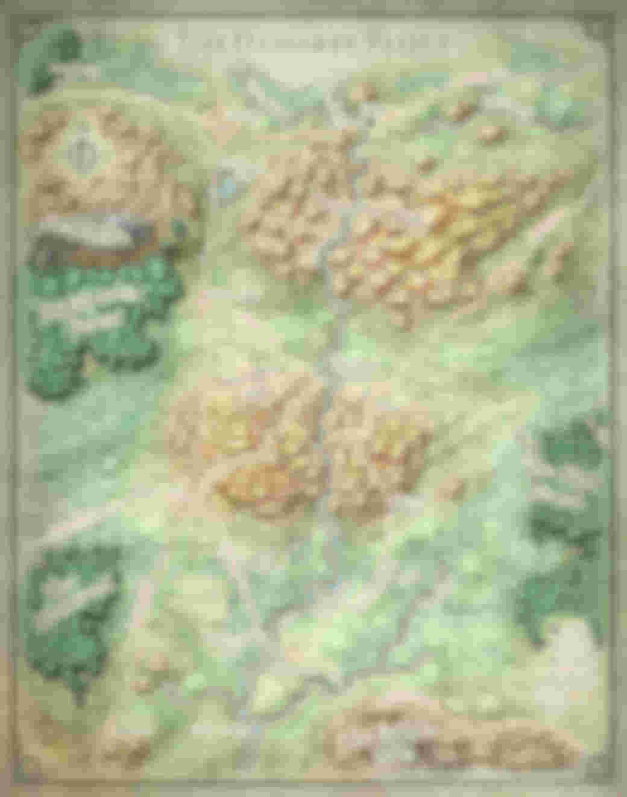

# Campaign 
Modified Princes of the Apocalypse starting at level 8. 

## Resources
### Docs 
* [Elemental Evil Players Companion PDF (23 MB)](https://media.wizards.com/2015/downloads/dnd/EE_PlayersCompanion.pdf)

### Maps 

    
Dessarin Valley

    

 

## Characters 
    Coming soon 
### PCs 
    Coming soon
### NPCs
    Coming soon

## Campaign Logs
### Wed 17 Apr 2019 

Character creation and campaign rules discussion.

#### Character creation
4 Characters at 8th level. Two druids, a wizard and a mutliclass rogue/ranger

#### Rules discussion
* Base game rules
* All spells and abilities from official 5e books are available
* Critical failures might have dire consequences

